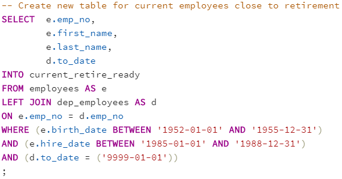
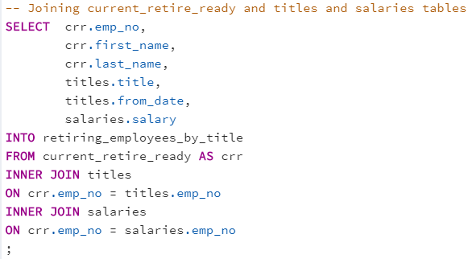
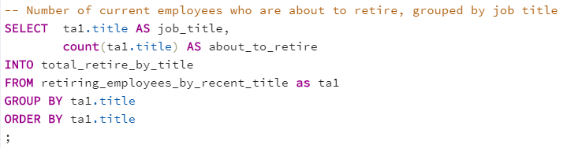
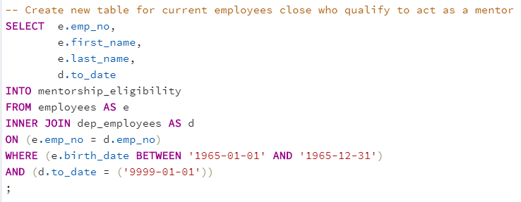
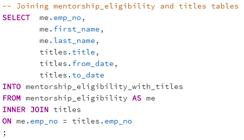
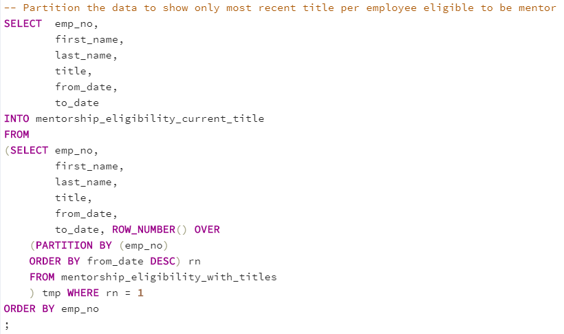
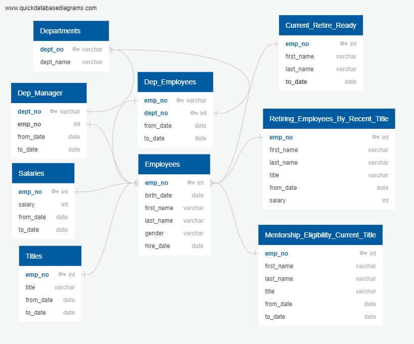
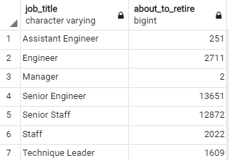

# Module 7 Challenge - Pewlett Hackard

## Challenge Overview

1.  Delivering Results: A README.md in the form of a technical report that details your analysis and findings

2.  Technical Analysis Deliverable 1: Number of Retiring Employees by Title. 
- A table containing the number of employees who are about to retire, grouped by job title (and the CSV containing the data)

3.  Technical Analysis Deliverable 2: Mentorship Eligibility. 
- A table containing employees who are eligible for the mentorship program (and the CSV containing the data)

## Resources

[Data Sources](data)

Software: PostgreSQL, pgAdmin 4

## Challenge Summary

### 1. Technical Report

**Overview**

The manager would like to know how many roles will need to be filled as the “silver tsunami” begins to make an impact at Pewlett Hackard (technical analysis #1). They would also like to identify retirement-ready employees who qualify to mentor the next generation of Pewlett Hackard employees (technical analysis #2). 

**Analysis Performed**

*Technical Analysis 1*

In order to fulfill technical analysis #1, a new table (current_retire_ready) needed to be created in order to initially capture the required information (employees born between January 01, 1952 and December 31, 1955; hired between January 01, 1985 and December 31, 1988; currently employed) - this was achieved by joining the employees table with the dep_employees table to capture the employee number, first name, last name, and employment to date (filtered for active employees - selected only to dates that were 9999-01-01).

Next, a second new table (retiring_employees_by_title) was created by joining current_retire_ready with the titles and salaries tables in order to capture the employees title, from date, and salary. 

Upon review of retiring_employees_by_title, it was noted that there were numerous duplicate employee records due to those employees who had title changes throughout their employment would be shown based on all their various titles. In order to only capture the most recent title, the data was then partitioned to show only the most recent title per employee (retiring_employees_by_title). 

Lastly, after it was confirmed there is only one title per employee, using the group by function, the total number of current employees who are about to retire grouped by job title (total_retire_by_title) was created in order to provide the manager as requested. There were no challenges noted for this technical analysis.

 *Technical Analysis 2*
 
In order to fulfill technical analysis #2, a new table (mentorship_eligibility) needed to be created in order to initially capture the required information (employees born betweem January 01, 1965 and December 31, 1965; currently employed) - this was achieved by joining the employees table with the dep_employees table to capture the employee number, first name, last name, and employment to date (filtered for active employees - selected only to dates that were 9999-01-01).

Next, a second new table (mentorship_eligibility_with_titles) was created by joining mentorship_eligibility with the titles table in order to capture the employees title, to date, and from date.

Upon review of mentorship_eligibility_with_titles, it was noted that there were numerous duplicate employee records due to those employees who had title changes throughout their employment would be shown based on all their various titles. In order to only capture the most recent title as per management request, the data was then partitioned to show only the most recent title per employee (mentorship_eligibility_current_title). There were no challenges noted for this technical analysis.

**Results, limitations, and next steps**

Per technical analysis #1, there will be 33,118 employees approaching retirement. Senior Engineers (13,651) and Senior Staff (12,872) combined comprise 80% of the total employees approaching retirement, while Engineer (8%), Staff (6%), Technique Leader (5%), and Assistant Engineer (1%) make up the difference. Only 2 Managers meet the criteria for employees approaching retirement, which should not be a concern to fill as there appears to be ample availability among current employees for a potential promotion.

One limitation noted within technical analysis #1 is that location of these employees aren't known (assumption: there are multiple company locations across the country). Further analysis over their specific locations would be helpful to better understand which locations will be impacted the most by the "silver tsunami".

Per technical analysis #2, there will be 1,549 employees eligible to be a part of the mentorship program. Senior Staff (569) and Senior Engineer (529) combined comprise over 70% of eligible employees, while Engineer (12%), Staff (10%), Technique Leader (5%), and Assistant Engineer (2%) make up the difference. It is interesting to note that no Managers met the criteria (born in 1965, currently employed), a potential issue if the mentorship program were to extend to Managers as well. Recommend to expand the criteria to capture a larger pool of applicants.

One limitation noted within technical analysis #2 is that no gender identity, ethnic/race, or ability information is presented. When setting up a mentorship program, it would be advised to ensure your pool of mentors are as diverse as the community they are serving (assumption: not everyone can be a mentor; application-based program). Further analysis over the potential mentors' gender identity, ethnic/race, and ability information be included to ensure a well rounded pool of mentors is achieved.

Historically there have been a total of 300,024 employees hired at Pewlett Hackard, and currently 240,124 remain actively employed. Regarding individuals being hired, the earliest hire occured in 1985 while the last employee hiring took place in 2000. Since the last title change occured in 2002, it seems odd that no employee was hired between 2000 and 2002, leading to the belief that the current raw data related to employee hiring may be out of date. It is recommended to confirm when the last time the record keeping was updated to ensure/confirm that all records are kept up-to-date. [hiring queries](queries/hiring.sql)

Entity Relationship Diagram - Pewlett Hackard

[ERD Script](queries/ERD%20script.txt)

### 2. Technical Analysis Deliverable #1 - Number of Retiring Employees by Title

[Technical Analysis Deliverable 1 - sql file](queries/tech_analysis_1.sql)

[Technical Analysis Deliverable 1a - csv file (totals by title)](data/technical_analysis_deliverable_1_totals_by_title.csv)

[Technical Analysis Deliverable 1b - csv file (full data)](data/technical_analysis_deliverable_1.csv)

### 3. Technical Analysis Deliverable #2 - Mentorship Eligibility

[Technical Analysis Deliverable 2 - sql file](queries/tech_analysis_2.sql)

[Technical Analysis Deliverable 2 - csv file](data/technical_analysis_deliverable_2.csv)

## Report completed by:

