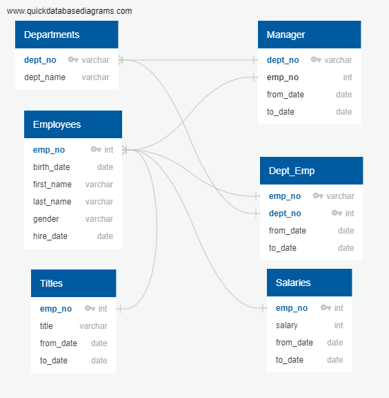

# Module 7 Challenge - Pewlett Hackard

Your manager would like to know how many roles will need to be filled as the “silver tsunami” begins to make an impact. They would also like to identify retirement-ready employees who qualify to mentor the next generation of Pewlett Hackard employees.

## Challenge Overview

1.  Delivering Results: A README.md in the form of a technical report that details your analysis and findings

2.  Technical Analysis Deliverable 1: Number of Retiring Employees by Title. 
- A table containing the number of employees who are about to retire, grouped by job title (and the CSV containing the data)

3.  Technical Analysis Deliverable 2: Mentorship Eligibility. 
- A table containing employees who are eligible for the mentorship program (and the CSV containing the data)

## Resources

[Data Sources](data)

Software: PostgreSQL, pgAdmin 4

## Challenge Summary

### 1. Results

In your first paragraph, introduce the problem that you were using data to solve.

In your second paragraph, summarize the steps that you took to solve the problem, as well as the challenges that you encountered along the way. This is an excellent spot to provide examples and descriptions of the code that you used.

In your final paragraph, share the results of your analysis and discuss the data that you’ve generated. Have you identified any limitations to the analysis? What next steps would you recommend?

Per technical analysis #1, there will be 33,118 employees approaching retirement. Senior Engineers and Senior Staff combined comprise 80% of the total 

A copy of the ERD you created when mapping out the database should also be included in your README.md.
Entity Relationship Diagram - Pewlett Hackard

[ERD Script](queries/ERD_script.txt)

### 2. Technical Analysis Deliverable #1 - Number of Retiring Employees by Title

[Technical Analysis Deliverable 1 - sql file](queries/tech_analysis_1.sql)

[Technical Analysis Deliverable 1a - csv file (totals by title)](data/technical_analysis_deliverable_1_totals_by_title.csv)

[Technical Analysis Deliverable 1b - csv file (full data)](data/technical_analysis_deliverable_1.csv)

### 3. Technical Analysis Deliverable #2 - Mentorship Eligibility

[Technical Analysis Deliverable 2 - sql file](queries/tech_analysis_2.sql)

[Technical Analysis Deliverable 2 - csv file](data/technical_analysis_deliverable_2.csv)

## Report completed by:

